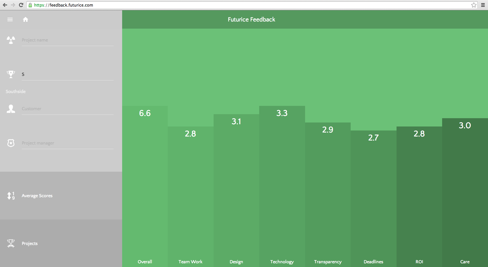
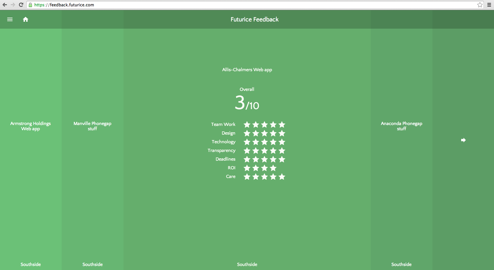

# Feeback Presentation App 

# About

The purpose of this project is to visualize feedback data gathered from customers. The actual data is stored in google docs and queried via proxy server.

The application has two main screens: Averages by topic view and project list view. User can navigate between the views from the sidebar menu. 





User can also apply filters to data in the sidebar menu. Filters are applied immediatly and the filtered results presented after the filter calculation has ended.

# Development

Requirements:

 * [Node and npm](http://nodejs.org/)
 * [Bower](http://bower.io)

## Setting up


```bash
$ git clone https://github.com/futurice-oss/feedback-presentation-app.git 
#...
$ npm install
$ bower install
```

To run the proxy server you need to type `node web.js`.
This will start the server at [localhost:8001](http://localhost:8001).

To store data we have used google sheets and a google script to access the data and serve it via JSON interface. An example sheet and script file are included in the repository. Run the app on your google drive with similiar sheet layout, correct sheet id and password configured in the web.js server script file.

The data received from the proxy server is in raw spreadsheet array data and has to be manipulated to the correct format. This data manipulation is done in seed-element-master/elements/x-project-service.html. 

```javascript
function(e) {
            //backend serves data from spreadsheets so a little bit of moving it around is in order
            var data = e.detail.response;
            var question_topics = _.chain(_.rest(_.zip.apply(_, data), 8))
                                   .map(function(elem){
                                     return _.first(elem, 2); 
                                     })
                                   .value();

            var projects = _.chain(data)
                            .rest(3)
                            .map(function(project) {
                              return { 
                                questions: _.chain(project)
                                            .rest(8)
                                            .zip(question_topics)
                                            .map(function(elem) { return { topic: elem[1][0], question: elem[1][1], answer: elem[0] } ; })
                                            .filter(function(elem) { return elem.answer !== "";})
                                            .value(),
                                project_name: project[0],
                                project_manager: project[1],
                                date: Date.parse(project[2]),
                                customer_company: project[3],
                                customer_contact: project[4],
                                npa_score: project[5],
                                comment: project[6],
                                tribe: project[7]
                              }; 
                            })
                            .sortBy(function(elem) { return elem.date; })
                            .reverse()
                            .map(function(p){ return {'key': p.project_name, 'value': p};})
                            .value();
          //in correct data format now
          element.projects = projects;
          }
```


If you are not using the same backend configuration as we did just ignore the code above and provide your data in the correct format from your backend API. The compatible data format for the app is shown below.

```javascript
var data_in_compatible_format = [{
  key: "Intl. Multifoods Android app",
  value: {
    comment: "",
    customer_company: "Intl. Multifoods",
    customer_contact: "Yolande Juliano  ",
    date: 1407937555515,
    npa_score: 4,
    project_manager: "Harriette Wendt  ",
    project_name: "Intl. Multifoods Android app",
    questions: [
      0: {
        answer: 1
        question: "How easy was it to cooperate with the project team?"
        topic: "Team Work"
      },
      1: {
        answer: 3
        question: "How do high do you value our design work?"
        topic: "Design"
      }]
    }
  },
  ...]
```


# License

[BSD 3-Clause](LICENSE.txt)
